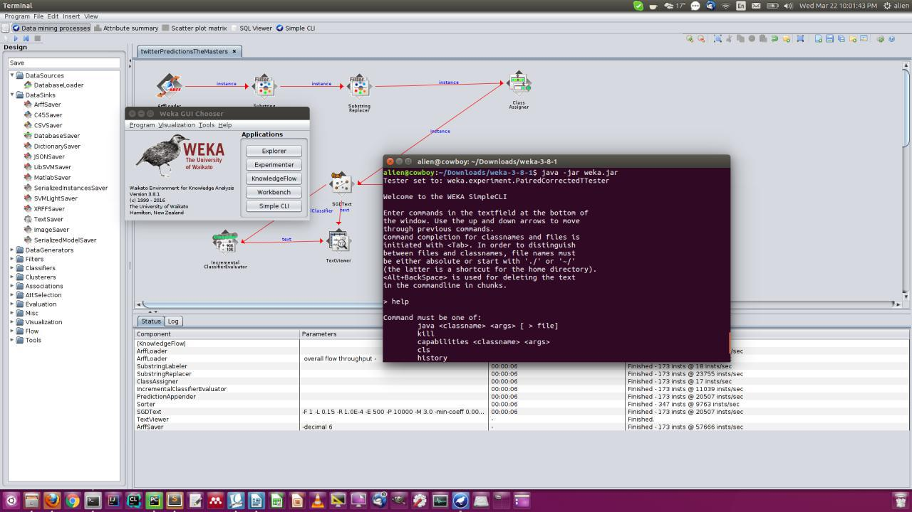
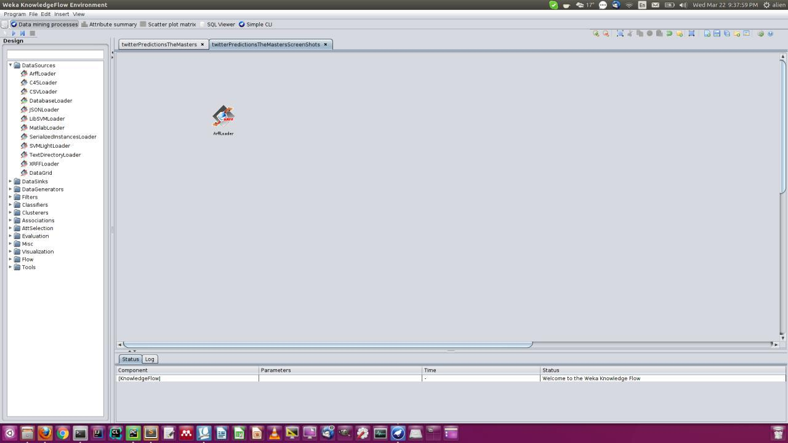
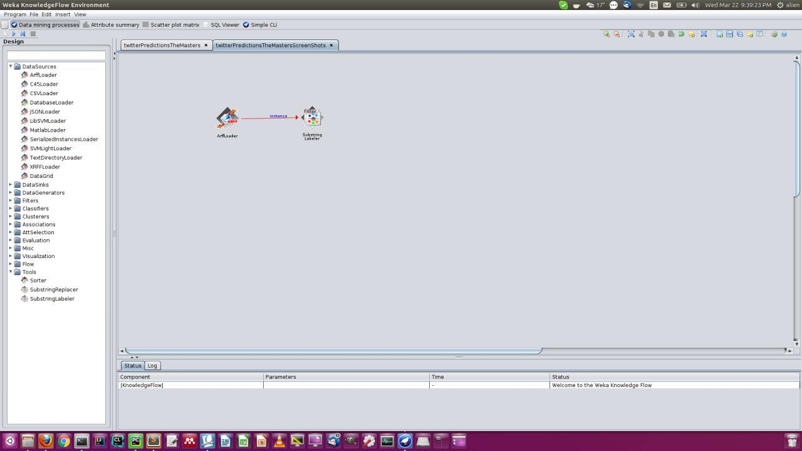
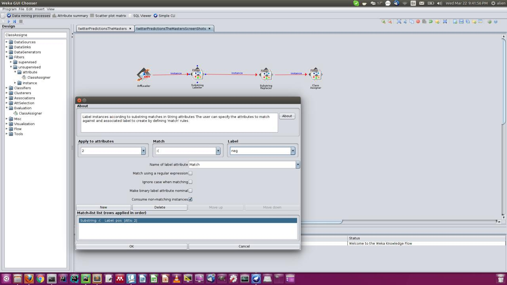
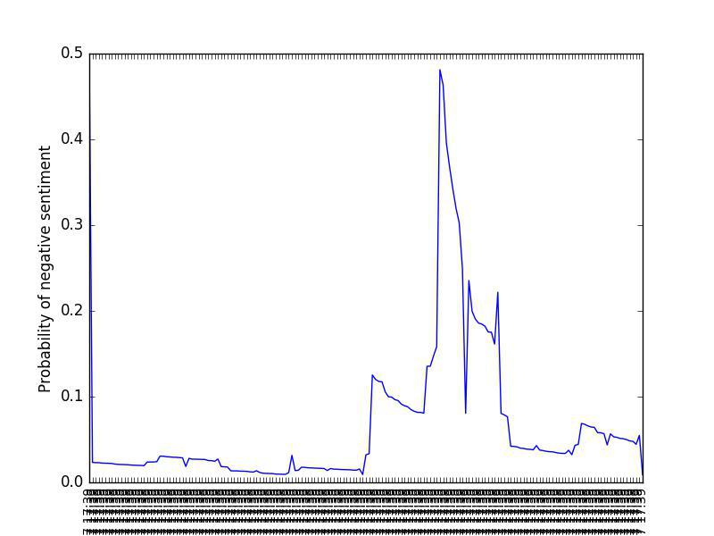
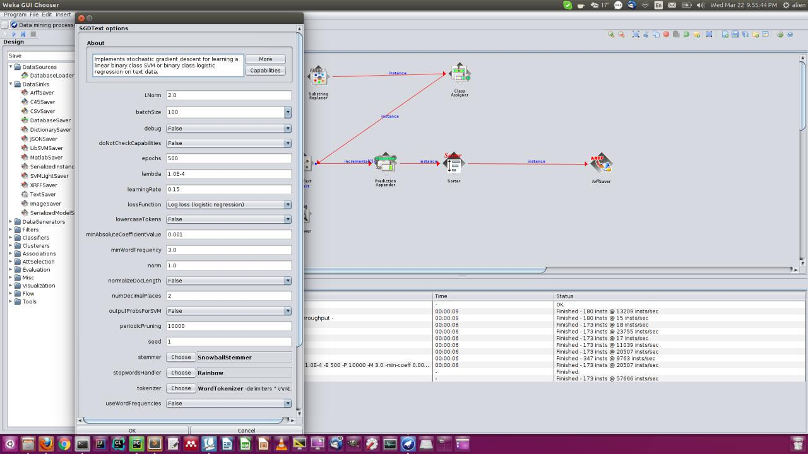

# BigDataProject
Implementation of the article:
Opinion Mining and Sentiment Polarity on Twitter and Correlation Between Events and Sentiment

###### USAGE for twitter4j:
javac -c $CLASSPATH SearchQuery.java
java -c $CLASSPATH SearchQuery sec_key1 sec_key2 sec_key3 sec_key4

###### REPORT
Content
* Data Collection method
* Data correction
* Work with WEKA
* Training the Data
* Data analysis

###### Data collection method:
We used apache Flume to collect the data from the twitter feedback.
The selected Event was “The Masters Tournament” is one of the four major championships in men's professional golf. And the keywords we used to get twitter data is “TheMasters” .
The data collection period was starting from the March 8 2017 to April 14, 2017. 
With the above mentioned dates we collected 2784 number of files and the size of those files were 0.637G. 

###### Data correction:
The cleaning part has been implemented twice in different languages but the logic remains the same. We take the tweets convert into tokens remove the tokens that start with hashtag and at symbols because they represent the usernames and hashtags and do not convey any meaningful sentiments.
Next we get rid of the punctuation symbols. It is quite common for tweets to consist of urls which are also removed in this phase. For weka we use the tools that weka provided to remove the stop words and do stemming on the non stop words. We also are concerned with the doing sentiment analysis with only the english language. Hence we also remove those words that are not a part of the english language. Numbers do not convey sentiment as well so we filter them out as well. For the non final phases we exported this data to a custom format Attribute-Relation File Format which is the desired format that is needed for weka input.

###### Work with WEKA:
Weka is a opensource free data mining tool that we have used for sentiment analysis
of twitter data following the directions given in the paper. We have collected
twitter data using Flume in JSON format and converted it to ARFF format that Weka
understands. The conversion code is github.

Here is the step by step description of how to reproduce the work in weka side.
Weka GUI can be started from the command line as following

##### figure 1

##### figure 2

One of the intrfaces in the Weka is KnowledgeFlow interface. Here we have picked
and place different modules of sentiments analysis system. Modules can be picked up
as following figure. The first module is ARFF loader Illustration 1 which has
option to browse to the local twitter data file and load it to weka

##### figure 3

In Fig3 we have added Substring labeler which is used to label raw data to classes
here pos and neg based on some bag of positive and negative words. We have sampled
300000 of such words from [1] http://www.cs.uic.edu/~liub/FBS/sentimentanalysis.
html. We also external lexicon which has been suggested in the work we are
reproducing which is emotonics smileys. Fig4 shows the method to add label manually

##### figure 4

We have replaced uwanted word using substring replacedr module and assigned a
training tweet to a class using class assigner module following the directions of
the original work. Now we have our processed training data with two features
twitter id and tweet.
We have then passed the instance of training data to SGDText module which is
responsible for doing Stochastic Gradient descent on logistic regression on the
text data. We have also Stemming, Stop word handling and tokenizing has been done
in this stage following the methods described in paper. SGDText uses incermental
classification of training and validation of the data. After perfoming logidtic
regression the text has been predicted with class probability. The probabilities
here are the positive and negative sentiment. The output has been sorted (by
descending negative sentiment probability) to easily find out any critical event
using sorter Module.
The prediction data has been saved using Arff saver Module. We have collected the
prediction data . We have plotted the sentiment data time series using python
in figure 5

##### figure 5

##### figure 6

###### Training the Data:
In spark we first create a data frame with 'labels' and 'tweets' in the next step we use tokenizer to convert it into 
tokens. We then remove the stop words and then we apply an Ngram feature and transform the data using ngram feature 
with n=1 or unigram. Then we do a random split of 0.4 and 0.6 and use one set for training the classifier and other 
for testing it. Next we implement the naive bayes classifier with the training and the testing splits of the data.
Alternatively we also implement a TFIDF model with the same approach and naive bayes using word to vector conversion.

##### Folder Structure
* BigDataProject
    * lib       --all the external file goes here
    * src       --dir of java source
        * bigdata.twitterapi        --data collection code using twitter4j
        * bigdata.mapreduce         --map reduce code for sentiment analysis
        * flume                     --flume codes and configuration if any
    * scripts                       --scripts python, shell etc
    * conf                          --Hadoop configuration file

Please do no add build artifacts or IDE specific .xml files. only Hadoop
configuration .xml files can be uploaded
